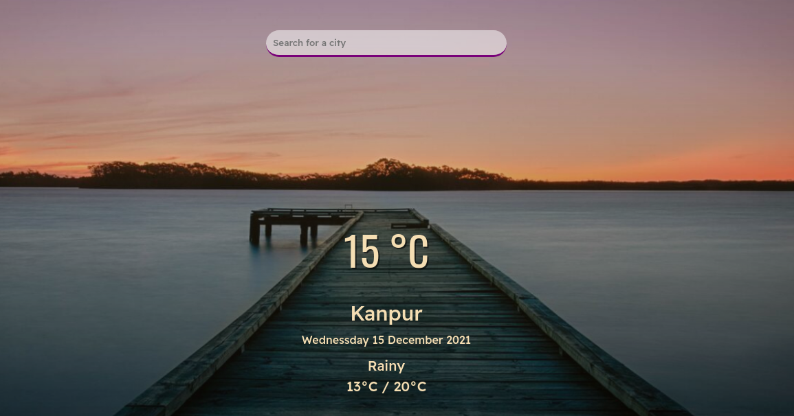

# *WeatherApp* 🌺
Displays current weather using API of selected City. 
☁️ **Uses FetchAPI to access data in JSON format from OpenWeatherMap.**  
 
Have a look :point_right: [HERE](https://prakhart111.github.io/WeatherApp/)

- Enter the name of the city in the search box
- Then Press Enter
- You will have weather information on your screen 😄

  

>Background Image rights are reserved to the repective owner
